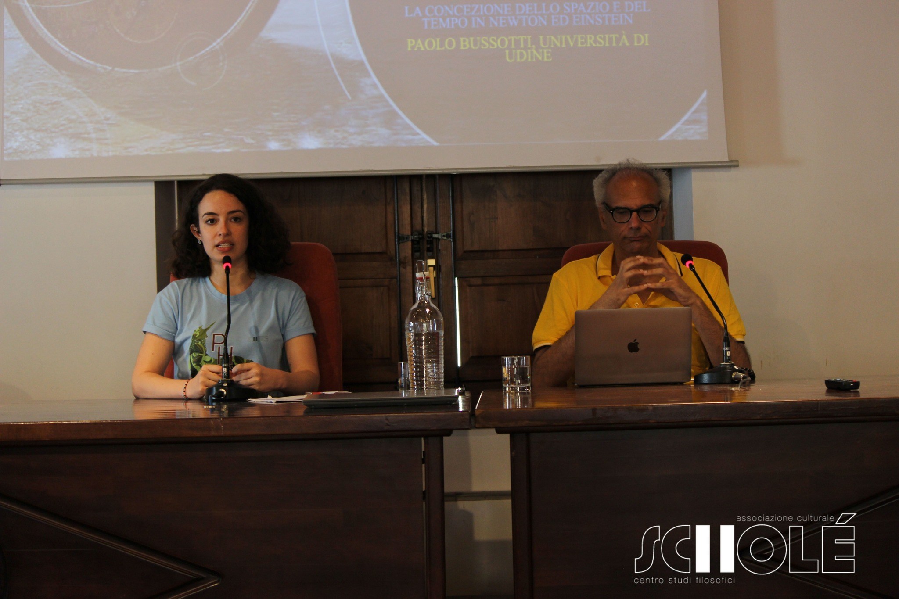

I'm a member of the nonprofit organization <b>Scholé</b>. 
  
Our mission is to involve the general public in discussions about physics, philosophy and history. We arrange weekly seminars which are open to anybody in presence or on zoom, and we organize a Summer School in Roccella Jonica (RC), Italy every year at the end of July. 

This year (2023), we talked about <em>PHYSIS</em>: the relationship between man and Nature.

If you speak Italian and you are interested in our work, check out our [website](https://www.filosofiaroccella.it/) and our [Facebook page](https://www.facebook.com/Filosofiaroccella)!
