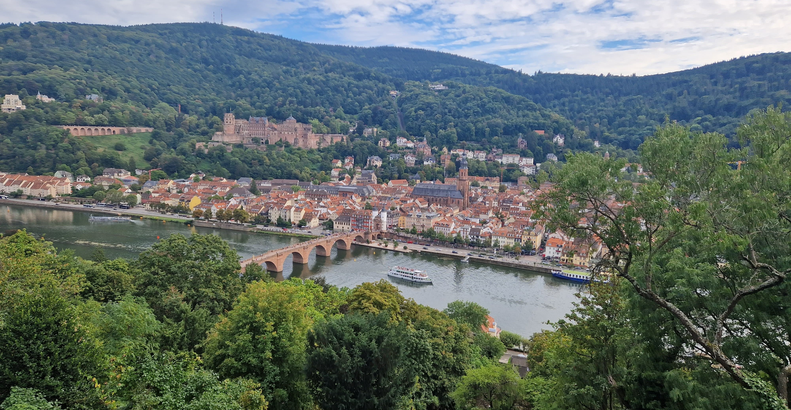

I'm Maria Paola, you can call me Paola for short :)

[See my full CV here](../files/MariaPaolaVaccaro_CV.pdf)

I'm an astrophysicist working in the field of gravitational-wave astronomy and black hole physics, with a focus on binary black hole dynamics in active galactic nuclei.

I'm a PhD candidate at the [Institute of Theoretical Astrophysics (ITA/ZAH)](https://www.zah.uni-heidelberg.de/welcome), Heidelberg University.
I work with [Michela Mapelli](http://web.pd.astro.it/mapelli/) in the [DEMOBLACK](http://demoblack.com/) group.

