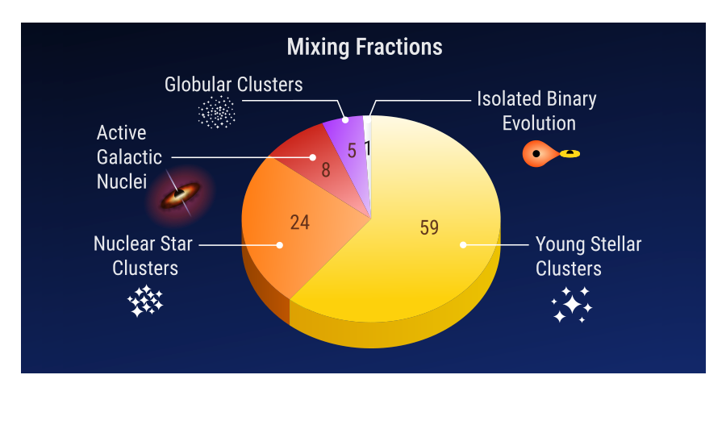
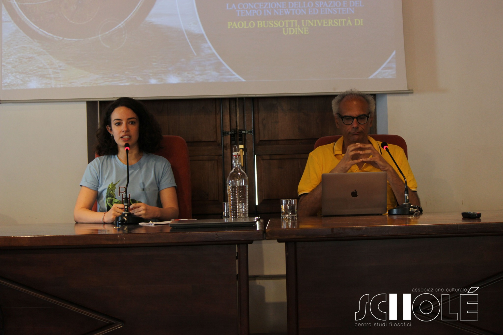

[Read my article](https://structures.uni-heidelberg.de/blog/posts/2025_03/index.php) on multiple formation channels of binary black hole mergers, with special focus on AGN disks and hierarchical assembly, on the STRUCTURES Blog.

<figure style="text-align: center;">

<figcaption> <em>Blogpost excerpt:</em> Fraction of mixed mergers over time in the AGN disk.**Estimate of the proportion of merger events arising from each channel, obtained by comparing simulated and observed black hole masses.</figcaption>
</figure>

I'm a member of the nonprofit organization <b>Scholé</b>. Our mission is to involve the general public in discussions about physics, philosophy and history. We arrange weekly seminars which are open to anybody in presence or on zoom, and we organize a Summer School in Roccella Jonica (RC), Italy every year at the end of July. 

If you speak Italian and you are interested in our work, check out our [website](https://www.filosofiaroccella.it/) and our [Facebook page](https://www.facebook.com/Filosofiaroccella)!

<figure style="text-align: center;">

<figcaption> Me and Prof. Paolo Bussotti during the summer school <em>PHYSIS</em> about the relationship between man and Nature.</figcaption>

</figure>

